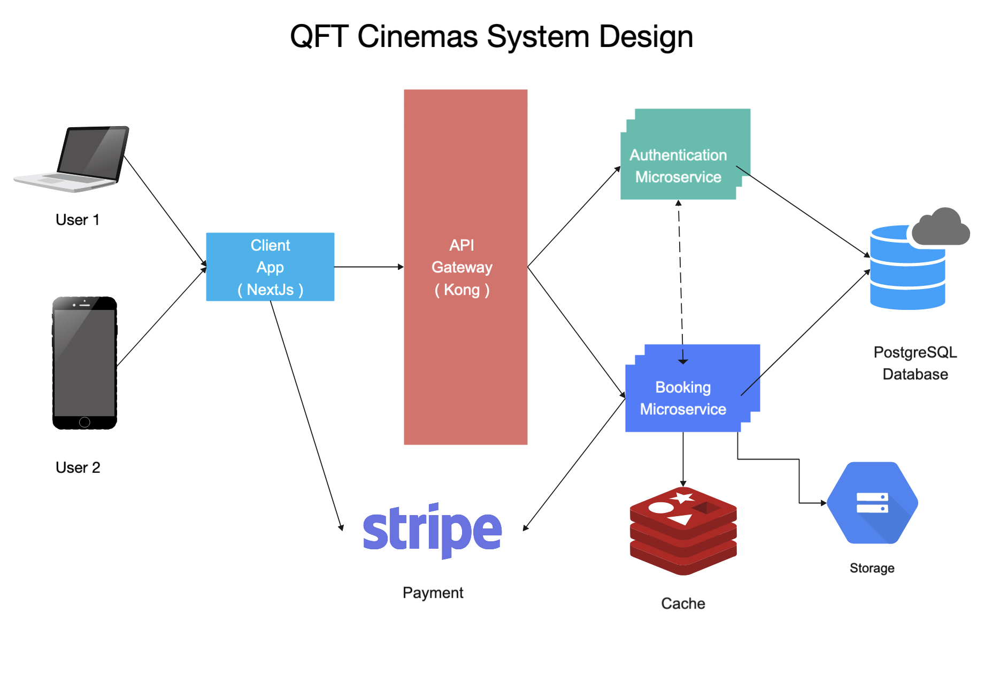
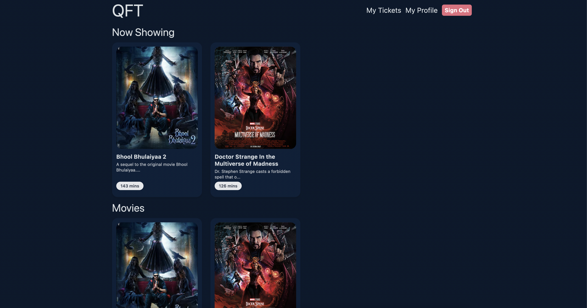
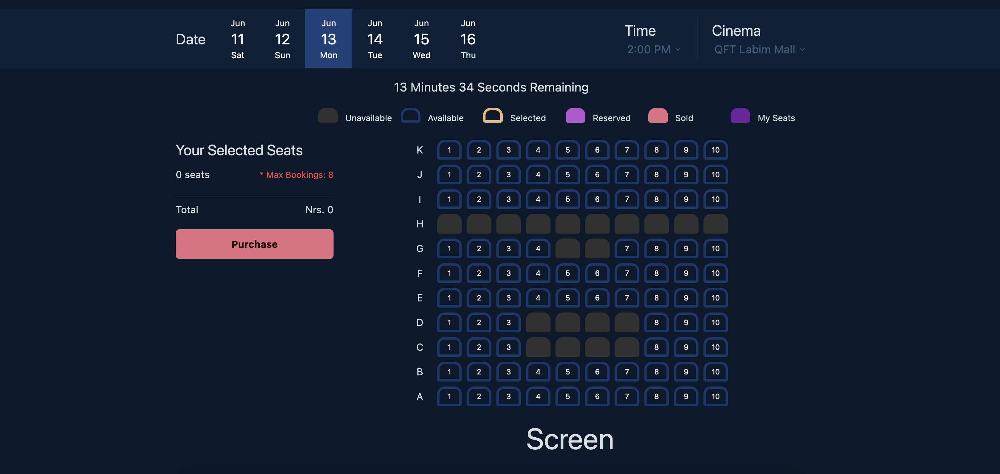
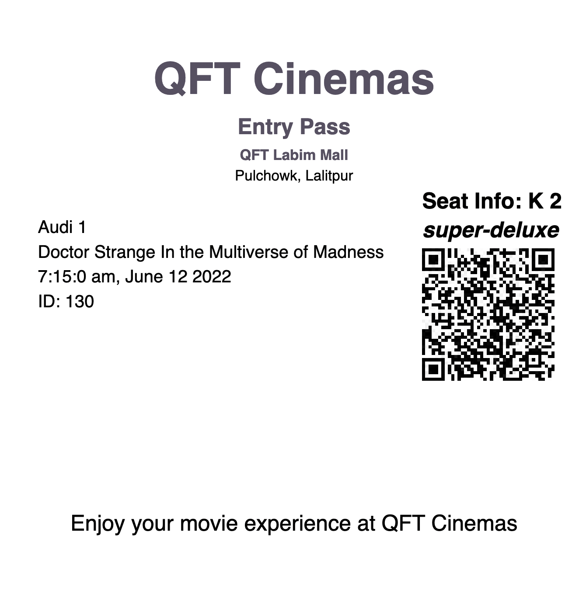

# [QFT Movie Booking System](http://qft.1a074a4ade81432ea931.eastasia.aksapp.io)

Usage docs on `USAGE.md` file in the root directory.

Urls: http://qft.1a074a4ade81432ea931.eastasia.aksapp.io or https://qft.vercel.app

## Features

### Auth Microservice

* Authentication using Auth Microservice [GoAuth](https://github.com/overlorddamygod/go-auth) createdy by [me](https://github.com/overlorddamygod).

### Movies and Booking microservice

* Built in [Go](https://go.dev).
    * List movies ( upcoming, as well as now showing )
    * Book and purchase tickets with [Stripe payments](https://stripe.com/).
        * Download and view tickets with QR Code.
        * Booked Seats has expiry time of 15 mins.
    * Add movie for screening
    * Add cinema, auditoriums and customize auditorium seat layouts.

### Client App

* Client app built in [Next.js](https://nextjs.org/).

